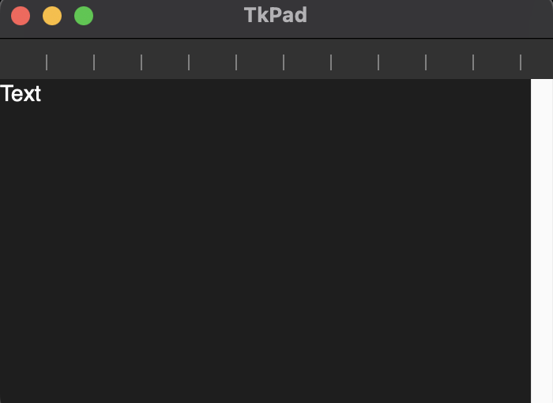

# TkPad
TkPad is a simple text editor application developed using the Tkinter library in Python 3. It provides users with a user-friendly interface to create, edit, and save text documents. TkPad serves as a practice project for integrating various features of Tkinter and implementing key functionalities of a text editor.

## Key Features
* **Graphical User Interface**: TkPad offers a visual interface where users can interact with buttons, menus, and a text area.
* **Text Editing Capabilities**: Users can create, edit, and modify text documents within TkPad. It supports basic text editing functionalities. The supported files types are .txt, .rtf and .py.
* **File Operations**: TkPad allows users to open and save text files. It provides options to create new files, open existing files, and save the edited documents.
* **Keyboard Shortcuts**: TkPad incorporates keyboard shortcuts to enhance productivity and user experience. Users can utilise regular operating system shortcut commands to save and open files, and to quit the application. Users can also use the zoom feature with shortcuts, which increases the font size. **These shortcuts are designed to work across different operating systems.**

## Usage
To use TkPad, simply run the application using a Python 3 interpreter. The graphical user interface will be displayed, presenting a blank text area where users can start typing. An alternative way of running the application is to head over to the release page and download the application from there.

## Dependencies
TkPad relies on Python 3, striprtf, and the Tkinter library, which is a standard GUI toolkit for Python. Ensure that both Tkinter and striprtf are installed before running the application. Striprtf can be installed through pip using `pip install striprtf`.